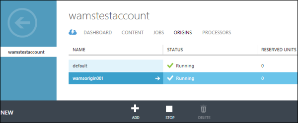
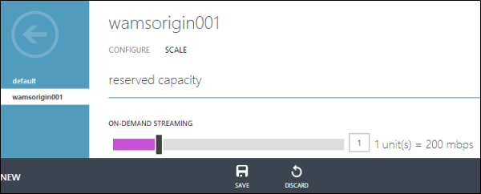
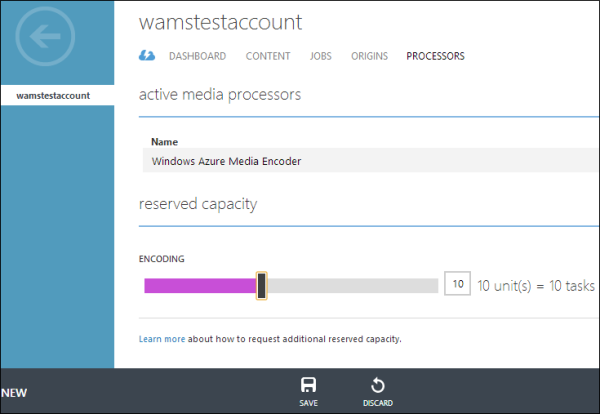

<properties linkid="manage-services-mediaservices-scale-media-service" urlDisplayName="How to scale" pageTitle="How to Scale a media service | Azure Documentation" metaKeywords="" description="Learn how to scale Media Services by specifying the number of On-Demand Streaming Reserved Units and Encoding Reserved Units that you would like your account to be provisioned with." metaCanonical="" services="media-services" documentationCenter="" title="How to Scale a Media Service" authors="migree" solutions="" manager="" editor="" />

如何缩放媒体服务
================

[WACOM.INCLUDE [免责声明](../includes/disclaimer.md)]

通过指定要为帐户设置的**“按需流式处理保留单位”**和**“编码保留单位”**数，可以缩放 Media Services。

按需流式处理保留单位
--------------------

按需流式处理保留单位为你提供了可按照 200 Mbps 的增量购买的专用出口容量和其他功能（当前包括[动态包装功能](http://go.microsoft.com/fwlink/?LinkId=276874)）。默认情况下，将在共享实例模型中配置按需流式处理，在该模型中，服务器资源（例如，计算、出口容量等）将与所有其他用户共享。若要增加按需流式处理吞吐量，建议购买按需流式处理保留单位。

若要更改按需流式处理保留单位数，请执行以下操作：

1.  在[管理门户](https://manage.windowsazure.cn/)中单击**“Media Services”**。然后，单击媒体服务的名称。

2.  选择“来源”页。然后，单击要修改的来源。

    

3.  若要指定保留单位数，请选择“缩放”选项卡并移动“保留容量”****滑块。

    

4.  按“保存”按钮保存更改。

    分配任何新的按需流式处理单位均需约 20 分钟才能完成。

    **注意：**当前，将按需流式处理单位的任何正值设置回“无”可将按需流式处理功能禁用最多 1 小时。

    **注意：**计算成本时将使用为 24 小时期限指定的最大单位数。有关定价详细信息，请参阅 [Media Services 定价详细信息](http://go.microsoft.com/fwlink/?LinkId=275107)。

编码保留单位
------------

设置的编码保留单位数等于可在给定帐户中同时处理的媒体任务数。例如，如果你的帐户有 5 个保留单位，则只要存在有待处理的任务，就会同时运行 5 个媒体任务。剩余任务将在队列中等待，并且在所运行的任务完成后，会立即按顺序选取这些任务进行处理。如果帐户没有设置任何保留单位，则将按顺序选取这些任务。在此情况下，从一个任务完成到下一个任务开始之间的等待时间将取决于系统中资源的可用性。

若要更改编码保留单位数，请执行以下操作：

1.  在[管理门户](https://manage.windowsazure.cn/)中单击**“Media Services”**。然后，单击媒体服务的名称。

2.  选择“处理器”页。

    

3.  按“保存”按钮保存更改。

    随即将会分配新的编码保留单位。

    **注意：**计算成本时将使用为 24 小时期限指定的最大单位数。

创建支持票证
------------

默认情况下，每个 Media Services 帐户最多可以扩展到 25 个编码保留单位和 5 个按需流式处理保留单位。你可以通过创建支持票证申请更高的限制值。

若要创建支持票证，请执行以下操作：

1.  在[管理门户](http://manage.windowsazure.cn)中登录到你的 Azure 帐户。
2.  转到[支持](http://www.windowsazure.cn/zh-cn/support/contact/)。
3.  单击“获取支持”。
4.  选择你的订阅。
5.  在支持类型下选择“技术”。
6.  单击“创建票证”。
7.  在下一页显示的产品列表中选择“Azure Media Services”。
8.  选择“媒体处理”作为“问题类型”，然后在类别下选择“保留单位”。
9.  单击“继续”。
10. 按下一页上的说明操作，然后输入有关需要多少编码保留单位或按需流式处理保留单位的详细信息。
11. 单击“提交”以创建该票证。

