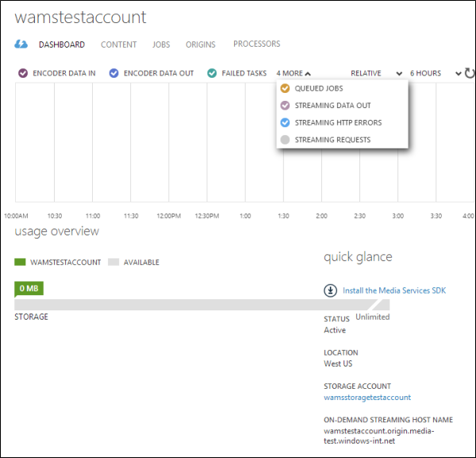

<properties linkid="manage-services-mediaservices-monitor-a-media-services-account" urlDisplayName="How to monitor" pageTitle="Monitor a Media Services Account - Azure" metaKeywords="" description="Describes how to configure monitoring for your Media Services account in Azure." metaCanonical="" services="media-services" documentationCenter="" title="How to Monitor a Media Services Account" authors="migree" solutions="" manager="" editor="" />

如何监视 Media Services 帐户
============================

Azure Media Services 仪表板显示了可用于管理 Media Services 帐户的使用度量值和帐户信息。

你可以监视由编码器中的输入和输出数据表示的已排队编码作业数、失败的编码任务数、活动的编码作业数，以及与 Media Services 帐户关联的 Blob 存储使用率。此外，如果要将内容流式传输给客户，你可以检索各种流式处理度量值。你可以选择监视过去 6 小时、24 小时或 7 天的数据。

**注意** 在 Azure 管理门户中监视存储数据会产生相关的额外费用。有关详细信息，请参阅[存储分析和计费](http://go.microsoft.com/fwlink/?LinkId=256667)。

如何：监视 Media Services 帐户
------------------------------

1.  在[管理门户](http://go.microsoft.com/fwlink/?LinkID=256666)中，单击**“Media Services”**，然后单击 Media Services 帐户名以打开仪表板。

    

2.  若要监视编码作业或数据，只需先将编码作业提交给 Media Services，或通过使用 Azure 媒体按需流式处理将内容流式传输给客户。大约一小时后，仪表板上会显示监视数据。

如何：监视 Blob 存储使用率（可选）
----------------------------------

1.  单击**“速览”**部分下的**存储帐户**名称。
2.  在存储帐户页上，单击**“配置页”**链接，然后向下滚动到 Blob、表和队列服务的**“监视”**设置，如下所示。

    **注意**：Blob 是 Media Services 中唯一受支持的存储类型。

    

3.  在**“监视”**中，为 Blob 设置监视级别和数据保留策略：

-   若要设置监视级别，请选择下列其中一项：

    **最少** - 收集经过汇总的有关 Blob、表和队列服务的入口/出口、可用性、延迟及成功百分比等度量值。

    **详细** – 除最少监视度量值外，在 Azure 存储服务 API 中为每项存储操作收集一组相同的度量值。通过详细监视度量值可对应用程序运行期间出现的问题进行进一步分析。

    **关闭** - 关闭监视。现有监视数据将一直保留到保留期结束。

-   若要设置数据保留策略，请在**“保留期(天)”**中，键入要保留数据的天数，范围介于 1 到 365 天之间。如果不需要设置保留策略，请输入零。如果没有保留策略，则是否删除监视数据由你自己决定。建议你根据要将帐户的存储分析数据保留多长时间来设置保留策略，以便可以由系统免费删除旧数据和未使用的分析数据。

1.  完成监视配置后，单击**“保存”**。与 Media Services 度量值类似，大约一小时后，仪表板上会显示监视数据。度量值存储在存储帐户中的以下 4 个表中：\$MetricsTransactionsBlob、\$MetricsTransactionsTable、\$MetricsTransactionsQueue 和 \$MetricsCapacityBlob。有关详细信息，请参阅[存储分析度量值](http://go.microsoft.com/fwlink/?LinkId=256668)。

