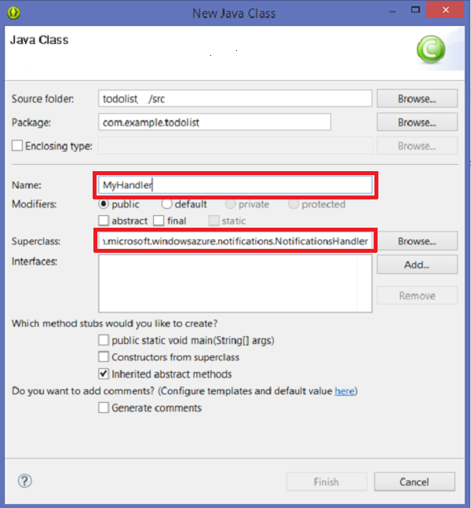

1. Open the file `AndroidManifest.xml`. In the code in the next two steps, replace _`**my_app_package**`_ with the name of the app package for your project, which is the value of the `package` attribute of the `manifest` tag. 

2. Add the following new permissions after the existing `uses-permission` element:

        <permission android:name="**my_app_package**.permission.C2D_MESSAGE" 
            android:protectionLevel="signature" />
        <uses-permission android:name="**my_app_package**.permission.C2D_MESSAGE" /> 
        <uses-permission android:name="com.google.android.c2dm.permission.RECEIVE" />
        <uses-permission android:name="android.permission.GET_ACCOUNTS" />
        <uses-permission android:name="android.permission.WAKE_LOCK" />

3. Add the following code after the `application` opening tag: 

        <receiver android:name="com.microsoft.windowsazure.notifications.NotificationsBroadcastReceiver"
            						 	android:permission="com.google.android.c2dm.permission.SEND">
            <intent-filter>
                <action android:name="com.google.android.c2dm.intent.RECEIVE" />
                <category android:name="**my_app_package**" />
            </intent-filter>
        </receiver>

4. Download and unzip the [Mobile Services Android SDK], open the **notifications** folder, copy the **notifications-1.0.1.jar** file to the *libs* folder of your Eclipse project, and refresh the *libs* folder.

    
<b>Note</b>
	
The numbers at the end of the file name may change in subsequent SDK releases.

    

5.  Open the file *ToDoItemActivity.java*, and add the following import statement:

		import com.microsoft.windowsazure.notifications.NotificationsManager;

6. Add the following private variable to the class, where _`<PROJECT_NUMBER>`_ is the Project Number assigned by Google to your app in the preceding procedure:

		public static final String SENDER_ID = "<PROJECT_NUMBER>";

7. In the **onCreate** method, before the MobileServiceClient is instantiated, add this code which registers the Notification Handler for the device:

		NotificationsManager.handleNotifications(this, SENDER_ID, MyHandler.class);

	Later we define the MyHandler.class referenced in this code.
	

8. In the Package Explorer, right-click the package (under the `src` node), click **New**, click **Class**.

9. In **Name** type `MyHandler`, in **Superclass** type `com.microsoft.windowsazure.notifications.NotificationsHandler`, then click **Finish**

	

	This creates the new MyHandler class.

10. Add the following import statements:

		import android.content.Context;
		import android.content.Context;
		import android.content.Intent;

		import com.microsoft.windowsazure.mobileservices.RegistrationCallback;
		
11. Next add this code to the class:

		public static final int NOTIFICATION_ID = 1;
		private NotificationManager mNotificationManager;
		NotificationCompat.Builder builder;
		Context ctx;

12. Add the following code to override the **onRegistered** method: which registers your device with the mobile service Notification Hub.

		@Override
		public void onRegistered(Context context, String gcmRegistrationId) {
			super.onRegistered(context, gcmRegistrationId);
			
			ToDoActivity.mClient.getPush().register(gcmRegistrationId, null, new RegistrationCallback() {
	            @Override
	            public void onRegister(Registration registration, Exception exception) {
	                  if (exception != null) {
	                        // handle error
	                  }
	            }
	      	});
		}

13. Add the following code to override the **onReceive** method, which causes the notification to display when it is received.

		@Override
		public void onReceive(Context context, Bundle bundle) {
		    ctx = context;
		    String nhMessage = bundle.getString("message");
	
		    sendNotification(nhMessage);
		}
	
		private void sendNotification(String msg) {
			mNotificationManager = (NotificationManager)
		              ctx.getSystemService(Context.NOTIFICATION_SERVICE);
	
		    PendingIntent contentIntent = PendingIntent.getActivity(ctx, 0,
		          new Intent(ctx, ToDoActivity.class), 0);
	
		    NotificationCompat.Builder mBuilder =
		          new NotificationCompat.Builder(ctx)
		          .setSmallIcon(R.drawable.ic_launcher)
		          .setContentTitle("Notification Hub Demo")
		          .setStyle(new NotificationCompat.BigTextStyle()
		                     .bigText(msg))
		          .setContentText(msg);
	
		     mBuilder.setContentIntent(contentIntent);
		     mNotificationManager.notify(NOTIFICATION_ID, mBuilder.build());
		}

Your app is now updated to support push notifications.
