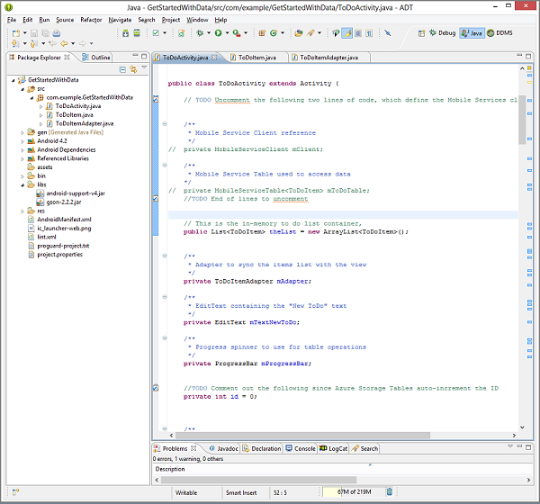

1. In Package Explorer, expand **GetStartedWithData**, **src**, and **.com.example.GetStartedWithData**, then examine the ToDoActivity.java file.

   	

   	Notice that there are `//TODO` comments that specify the steps you must take to make this app work with your mobile service.

2. From the **Run** menu, click **Run** and then click **Android Application** to start the project.

	
<strong>Note</strong> 
You can run this project using an Android phone, or using the Android emulator. Running with an Android phone  requires you to download a phone-specific USB driver.
 
To run the project in the Android emulator, you must define a least one Android Virtual Device (AVD). Use the AVD Manager to create and manage these devices.

3. In the app, type meaningful text, such as _Complete the tutorial_, and then click **Add**.

   	

   	Notice that the saved text is stored in an in-memory collection and displayed in the list below.